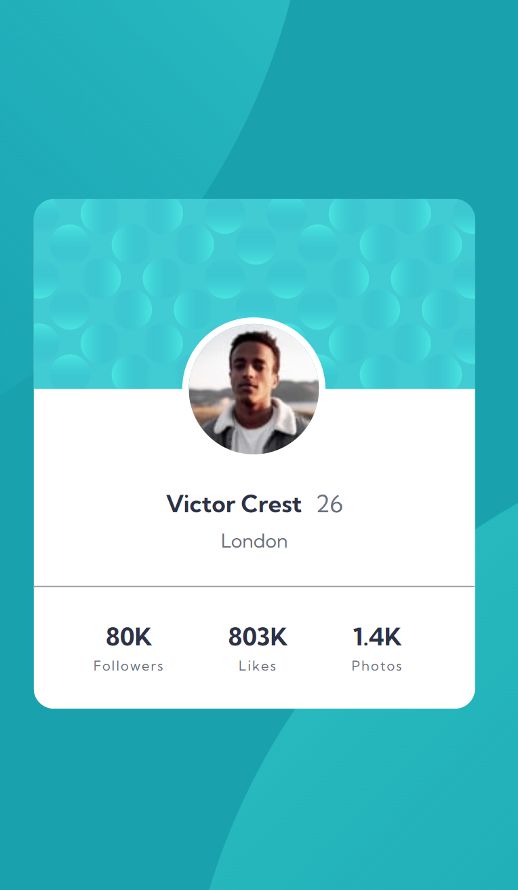
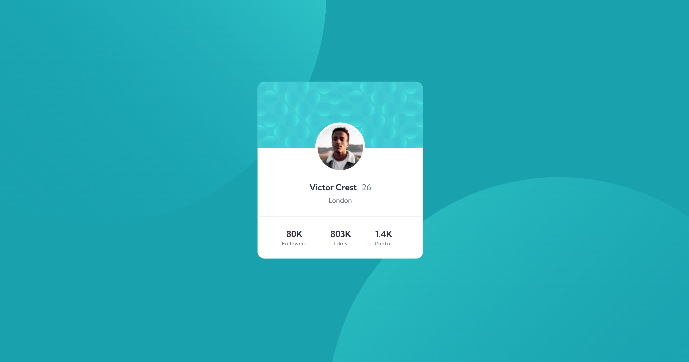

# Frontend Mentor - Profile card component solution

Esta é uma solução para o [Profile card component challenge on Frontend Mentor](https://www.frontendmentor.io/challenges/profile-card-component-cfArpWshJ). Os desafios do Frontend Mentor ajudam você a melhorar suas habilidades de codificação através da construção de projetos realistas. 

## Índice

- [Visão geral](#visão-geral)
  - [Screenshot](#screenshot)
  - [Links](#links)
- [Meu processo](#meu-processo)
  - [Construído com](#construído-com)
  - [O que eu aprendi](#o-que-eu-aprendi)
  - [Desenvolvimento contínuo](#desenvolvimento-contínuo)
- [Autor](#autor)

## Visão geral

### Screenshot

Desktop

Mobile

### Links

- Live Site URL: [Profile card component](https://isabela-fernanda.github.io/Profile-card-component-main/)

## Meu processo

### Construído com

- Semantic HTML5 markup
- CSS custom properties
- Flexbox
- CSS Grid
- Mobile-first workflow

### O que eu aprendi

Neste projeto eu usei o flex para criar o site desejado.

### Desenvolvimento contínuo

Planejo continuar focando em projetos de HTML e CSS para praticar e fixar o que aprendi sobre essas linguagens

## Autor

- Frontend Mentor - [@Isabela-Fernanda](https://www.frontendmentor.io/profile/Isabela-Fernanda)